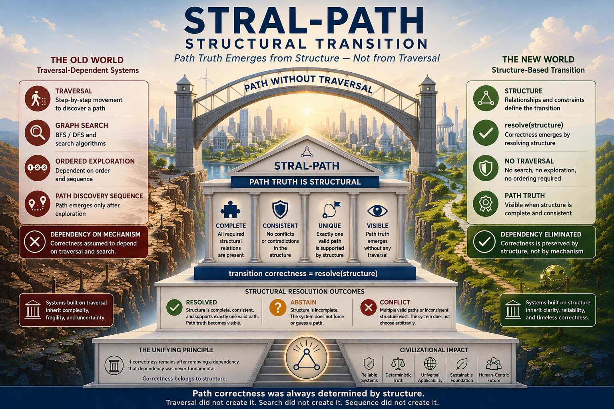

# ⭐ STRAL-Path

**System Path Resolution Without Traversal — Structural Transition Kernel**


**Proven in a tiny executable kernel.**

Path correctness in systems emerges directly from structure — without requiring traversal, graph search, ordered exploration, or step-by-step movement for correctness.

---

**Deterministic • Structure-Based • No Traversal • No Graph Search • No Ordered Exploration**

No Time • No Path Discovery Sequence • No Traversal Dependency

---

## ⚡ **The Claim**

A valid path can be determined without traversal, graph search (`BFS / DFS`), or ordered exploration — when structure is sufficient.

---

## **The Unifying Principle**

`transition correctness = resolve(structure)`

If correctness remains after removing a dependency, that dependency was never fundamental.

---

## **Clarification — Machine-Level Evaluation**

This reference kernel runs as a minimal Python program and may perform internal evaluation.

**However, this evaluation is NOT traversal and is NOT the source of correctness.**

Correctness is determined solely by structural sufficiency — not by graph search, traversal order, path exploration, or sequencing.

Evaluation functions only as a resolution substrate, not as a source of correctness.

---

## **Practical Interpretation**

Use existing systems to realize paths.

Use STRAL-Path to resolve and validate structural path correctness.

---

## **Truth vs Realization**

STRAL-Path determines path truth, not physical traversal.

It establishes whether a path is structurally valid.

Real-world traversal, routing, transport, or motion may still belong to representation or execution layers.

---

## 🔥 **Break This STRAL-Path (Immediate Challenge)**

If traversal is required for correctness, this invariant must fail:

`same structure -> same visible state -> same certificate`

More precisely:

`S1 = S2`  
`VisibleState1 != VisibleState2 OR Certificate1 != Certificate2`

Or demonstrate any of the following within this model:

- incomplete structure -> forced path
- multiple valid paths -> arbitrary selection
- reordered identical structure -> different outcome

If none of these occur, traversal is not fundamental to path correctness in this model.

---

## 🌍 **A World Built on Traversal**

For decades, path systems have been built on dependencies:

- traversal
- graph search
- `BFS / DFS`
- ordered exploration
- path discovery sequence

Each treated as essential.

But what if they are not?

---

## 🔄 **The Shift**

Across domains, a pattern emerges:

correctness does not depend on the mechanism we assumed it did

It can be preserved by something deeper:

**structure**

---

## 🧱 **Dependency Elimination Framework**

| Domain | Removed Dependency | What Preserves Correctness |
|---|---|---|
| Time | clocks | structure |
| Decision | order | structure |
| Meaning | sequence | structure |
| Money | transactions | structure |
| Truth | agreement | structure |
| Computation | execution | structure |
| AI | inference | structure |
| Cybersecurity | process / pipelines | structure |
| Identity | authority / registry | structure |
| Consensus | voting / quorum | structure |
| Network | connectivity | structure |
| Cloud | cloud infrastructure | structure |
| Transition | traversal / search | structure |
| Integration | communication / coordination | structure |

Each row removes a dependency — yet correctness remains intact.

Nothing is replaced.  
Nothing is approximated.  
Only the dependency is eliminated.

---

## ⚡ **The One-Line Breakthrough**

Path correctness does not require traversal — when structure is sufficient.

---

## ⚡ **Try it in 30 seconds**

**Python demo:**

```
python demo/stral_visual_path_demo.py
```

**Browser demo:**

```
python -m http.server 8000
```

Then open:

```
http://localhost:8000/demo/stral_visual_path_demo.html
```

Verify:

- deterministic path resolution
- no forced path truth under incomplete structure
- no arbitrary choice under multiple valid paths
- identical structure -> identical visible state and certificate

`normalized_visible_state = normalize(visible_state)`  
`certificate = SHA256(normalized_visible_state)`

---

## 🔍 **What You Will Observe**

- deterministic path resolution
- no traversal dependency
- no graph search dependency
- no ordered exploration
- incomplete structure produces no forced path
- multiple valid paths produce no arbitrary choice
- invalid competing paths are rejected without overriding valid paths
- identical structure produces identical visible state and certificate

---

## 🔹 **What this output represents**

This is a real transition state:

- `selected_path = PATH_A` -> exactly one structurally valid path exists
- `resolution_state = RESOLVED` -> transition correctness is established
- `path_truth = SOURCE_TO_DESTINATION` -> valid transition becomes visible

These are the same classes of outcomes typically produced by routing engines, workflow systems, and graph-based evaluators.

Traditionally, such outcomes are derived through traversal, search (`BFS / DFS`), and ordered exploration.

Here, they emerge directly from structure—without traversal, search, or sequence.

The mechanism changes.  
The outcome does not.

---

## 🧭 **Visual Overview**



---

## 🧭 **Framework & References**

**Docs**
- [Quickstart](docs/Quickstart.md)
- [FAQ](docs/FAQ.md)
- [Proof Sketch](docs/Proof-Sketch.md)
- [STRAL-Path Diagram](docs/STRAL-Path-Structural-Transition.png)

**Framework**
- [STRAL Framework Document](docs/STRAL_v1.4.pdf)
- [STRAL Architecture Notes](docs/STRAL-Path-Architecture-Notes.md)
- [Dependency Elimination Framework](docs/Dependency-Elimination-Framework.png)
- [Shunyaya Structural Stack](docs/Shunyaya-Structural-Stack.png)

Part of a broader structural pattern (Dependency Elimination Framework) where removing assumed dependencies reveals that correctness is preserved by structure alone.

**Demo**
- [demo/stral_visual_path_demo.py](demo/stral_visual_path_demo.py)
- [demo/stral_visual_path_demo.html](demo/stral_visual_path_demo.html)

**Verification**
- [VERIFY/VERIFY.txt](VERIFY/VERIFY.txt)
- [VERIFY/FREEZE_DEMO_SHA256.txt](VERIFY/FREEZE_DEMO_SHA256.txt)

**Repository**
- [demo/](demo/) — kernel
- [docs/](docs/) — explanation
- [VERIFY/](VERIFY/) — reproducibility

---

## ⚡ **The Core Structural Model**

`path_truth_visible iff structure_mature`

`structure_mature = complete AND consistent`

`transition correctness = resolve(structure)`

Diagnostic state may remain visible even when no admissible path is visible.

This means:

- `ABSTAIN` and `CONFLICT` may still expose structural diagnostics
- path truth becomes visible only when structure is mature
- diagnostic visibility != admissible path visibility

---

## ⚠️ **Read This Carefully**

This is not:

- faster pathfinding
- optimized graph search
- automated traversal
- a new `BFS / DFS` variant

Traversal is not required for correctness.

Path correctness does not emerge from search.  
It is determined by structure.

---

## 🔥 **What This Proves (Removal of Dependencies)**

This kernel proves that path correctness does not require:

- traversal
- graph search
- `BFS / DFS`
- ordered exploration
- path discovery sequence

---

## 🔥 **Structural Transition Model**

`resolve(structure) ->`

`RESOLVED` if `structure_mature` and exactly one valid path exists  
`ABSTAIN` if structure is incomplete  
`CONFLICT` if multiple valid paths exist or structure is inconsistent

**Visibility rule:**

`path_truth_visible iff structure_mature`

In this reference implementation:

- `ABSTAIN` corresponds to incomplete structure
- `CONFLICT` corresponds to multiple structurally valid paths
- invalid competing structure is rejected without overriding a valid path

---

## 🛡 **Structural Safety Model**

`incomplete -> no forced path`  
`conflicting -> no arbitrary path`  
`complete -> deterministic path truth`

No guessing.  
No forcing.  
No artificial traversal dependency.

---

## 🧩 **Competing Path Handling**

When multiple candidate paths exist:

- structurally valid paths are evaluated independently
- invalid paths do not influence resolution
- incomplete paths do not override a valid path

Resolution outcome depends only on structurally valid paths.

---

## 🔐 **Structural Certificate**

Final structure produces a deterministic visible state and certificate:

`same structure -> same visible state -> same certificate`

**Certificate derivation:**

`normalized_visible_state = normalize(visible_state)`

`certificate = SHA256(normalized_visible_state)`

The certificate is therefore:

- reproducible
- derived from visible state
- traversal-independent
- search-order-independent

---

## 🔐 **Reference Implementation Hash (Reproducibility)**

The following SHA256 hashes define the exact released demo artifacts:

`demo/stral_visual_path_demo.py`  
SHA256: `17dd5d42e6953c81b5bb8cbf7edbef1e9d4a461078f59fcc45189dbc40d61ffa`

`demo/stral_visual_path_demo.html`  
SHA256: `54d43ef16efeb88c643fe48becaf26e7114f88bf72a74d8cbce0a4abce052ec7`

These hashes ensure:

`same artifact -> same behavior -> same structural result`

---

## ⚖️ **What This Proves / Does Not Prove**

**What This Proves**

- path admissibility can be resolved from structure
- traversal is not fundamental to path correctness in this reference model
- graph search is not fundamental to path correctness in this reference model
- incomplete structure does not force visible path truth
- multiple valid paths do not permit arbitrary selection
- invalid competing paths do not override a valid path
- identical structure produces identical visible state and certificate

**What This Does Not Prove**

- shortest path
- best path
- optimized routing
- elimination of physical movement
- replacement of graph theory
- arbitrary large-graph performance claims

---

## 🔁 **Deterministic Guarantees**

**Determinism**

`S1 = S2 -> VisibleState1 = VisibleState2 -> Certificate1 = Certificate2`

**Order Independence**

Fragment order does not matter.

**Idempotence**

Repeated runs -> identical result.

---

## 🧩 **Reference Demonstration**

**Scenario 1 — Unique Valid Path**  
Observe:
- exactly one structurally valid path resolves
- no unsupported path is forced

**Scenario 2 — Repeatability**  
Observe:
- repeated runs produce identical results

**Scenario 3 — Incomplete Structure**  
Observe:
- no forced path truth

**Scenario 4 — Multiple Valid Paths**  
Observe:
- `CONFLICT`
- no arbitrary selection

**Scenario 5 — Invalid Competing Path**  
Observe:
- invalid competing path is rejected
- valid path still resolves deterministically
- invalid alternative does not override a valid path

---

## 🧠 **Critical Insight**

System does not:

- traverse to discover correctness
- depend on graph search order
- require exploration sequence
- guess

Instead:

**it resolves structure**

---

## 🌌 **Why This Is Bigger Than It Looks**

This is a minimal proof that:

- path correctness does not require traversal
- search order does not determine correctness
- a valid path appears only when structure becomes mature

If this holds, transition correctness shifts from traversal-dependent determination to structure-based determination.

This is not the final system — it is the smallest demonstrable proof of a structure-first transition model.

---

## 🧠 **Structural Truth**

A possible path may exist in a graph.

But structural path truth may not.

The system does not guess.  
The system does not force.

It simply refuses to grant transition reality to what structure does not support.

---

## 📊 **Comparison**

| Model | Traversal Required | Search Required | Structure-Based | Deterministic |
|---|---:|---:|---:|---:|
| Traditional Graph Search | Yes | Yes | No | Conditional |
| Routing / Path Systems | Often Yes | Often Yes | Partial | Conditional |
| STRAL-Path | No | No | Yes | Yes |

---

## 🌍 **Implications**

If this scales:

- traversal becomes secondary
- path truth becomes structural
- search becomes representational
- correctness becomes intrinsic

---

## 🧾 **Structural Lineage**

STRAL-Path is part of a broader structural pattern emerging across domains:

`SLANG-Computation -> correctness without execution`  
`ORL -> correctness without ordering`  
`STINT-Money -> financial correctness without continuous connectivity`  
`STRAL-Path -> path correctness without traversal`

Each removes a different dependency.

Yet the outcome remains.

`transition correctness = resolve(structure)`

---

## 📏 **STRAL-Path Conformance**

An implementation is considered STRAL-Path compatible only if it preserves the following observable behaviors:

**1. Resolution Behavior**

`resolve(structure) ->`

`RESOLVED` if exactly one valid path exists  
`ABSTAIN` if structure is incomplete  
`CONFLICT` if multiple valid paths exist or structure is inconsistent

**2. Visibility Rule**

`path_truth_visible iff structure_mature`  
`structure_mature = complete AND consistent`

**3. Determinism**

`S1 = S2 -> VisibleState1 = VisibleState2 -> Certificate1 = Certificate2`

**4. Order Independence**

Reordering identical structure must not change:
- visible state
- certificate
- resolution outcome

**5. Safety Guarantees**

`incomplete -> no forced path`  
`conflicting -> no arbitrary path`

**6. Structural Priority**

Correctness must depend only on structure — not on:
- traversal
- search order
- evaluation order
- timing
- execution sequence

Any system violating the above is not STRAL-Path compliant.

---

## 📜 **License**

See: [LICENSE](LICENSE)

**Reference Implementation (This Repository):**

This tiny kernel is the official minimal example of the STRAL-Path model.  
It demonstrates the core principle in its simplest form.

Released as an **Open Standard** — free to use, study, implement, extend, and deploy.

Architecture and Documentation:  
CC BY-NC 4.0

---

## 🔭 **Roadmap (Exploratory)**

- structural conflict classification
- invariant validation
- canonical transition certificates
- additional killer demos
- transition equivalence layers

---

## 🔗 **Related Structural References**

- [ORL](https://github.com/OMPSHUNYAYA/Orderless-Ledger) — ledger correctness from structure without ordering
- [STOCRS](https://github.com/OMPSHUNYAYA/STOCRS) — computation from structure without execution
- [STIME](https://github.com/OMPSHUNYAYA/Structural-Time) — time from valid structural transitions
- [SSUM-Time](https://github.com/OMPSHUNYAYA/SSUM-Time) — structural clock for time reconstruction and recovery
- [SLANG-Computation](https://github.com/OMPSHUNYAYA/SLANG-Computation) — computation correctness from structure without execution flow, control flow, or prescribed sequencing
- [STINT-Money](https://github.com/OMPSHUNYAYA/STINT-Money) — financial correctness from structure without continuous connectivity, synchronization, or ordered communication

---

## 🧭 **Final Statement**

Traversal did not create path correctness.  
Search did not create path correctness.  
Sequence did not create path correctness.

Path was never discovered by traversal.  
It was always determined by structure.
